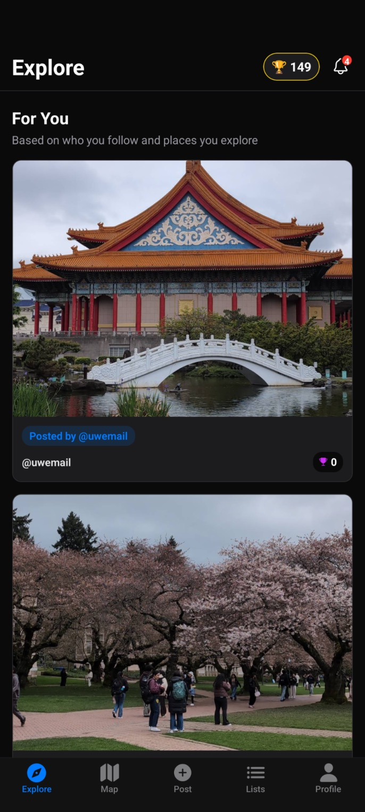
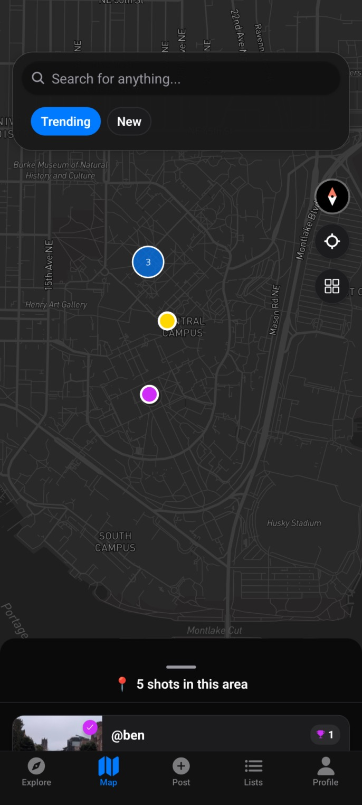
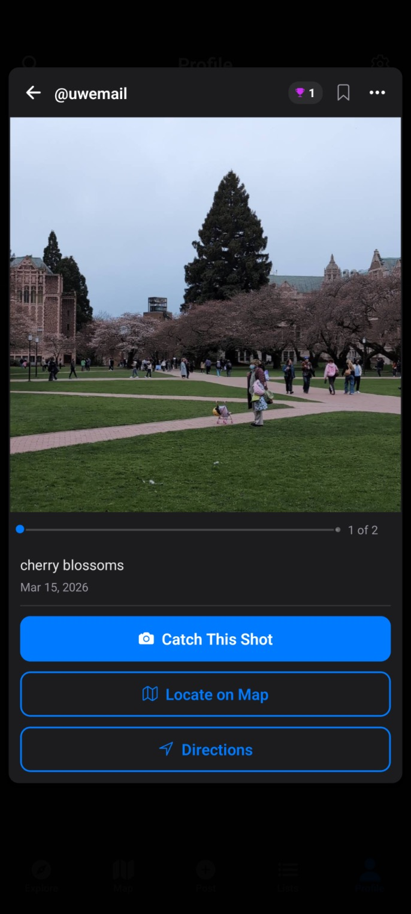
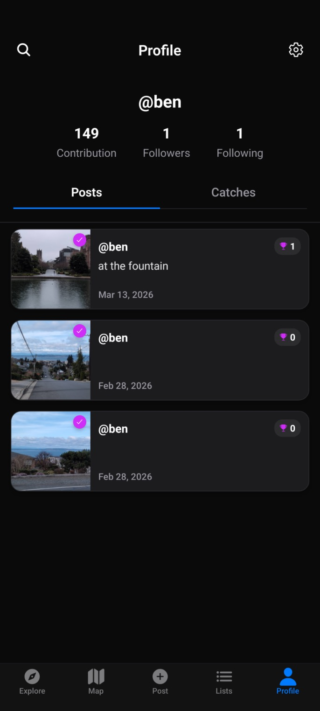

# Catch

Catch is a travel passport mobile app built with React Native and Expo. Users discover and share photos on a global map, and others "catch" them by visiting and taking a matching photo. It is powered by Firebase (Firestore, Auth, Storage, Cloud Functions) with a Gemini-based semantic search and an on-device ML model for verifying catch photos.

  
  
  
  

